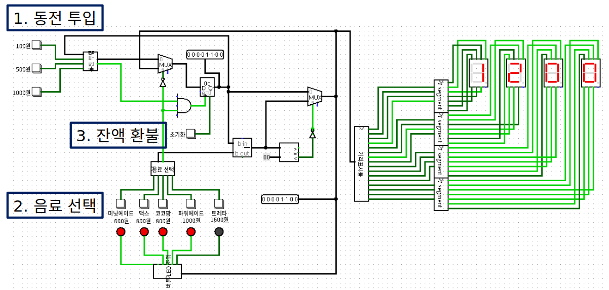
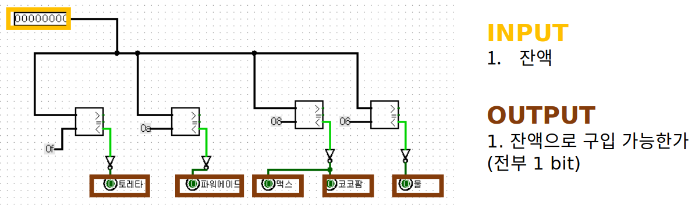

# bending-machine

> 프로젝트 **자판기**는 자판기 내부를 회로로 나타낸 것입니다.

## Project Stack
* logisim

## Project Algorithm

</img>

## Project Description
### Main

### Modules
#### 1. 동전 투입 모듈

동작 모습

#### 2. 음료 선택 모듈

동작 모습

#### 3. 버튼 LED 조명 모듈

동작 모습

#### 4. 가격 표시등 모듈

동작 모습

#### 5. 7 Segment 모듈
일반적인 7 Segment 모듈이라 설명 생략
